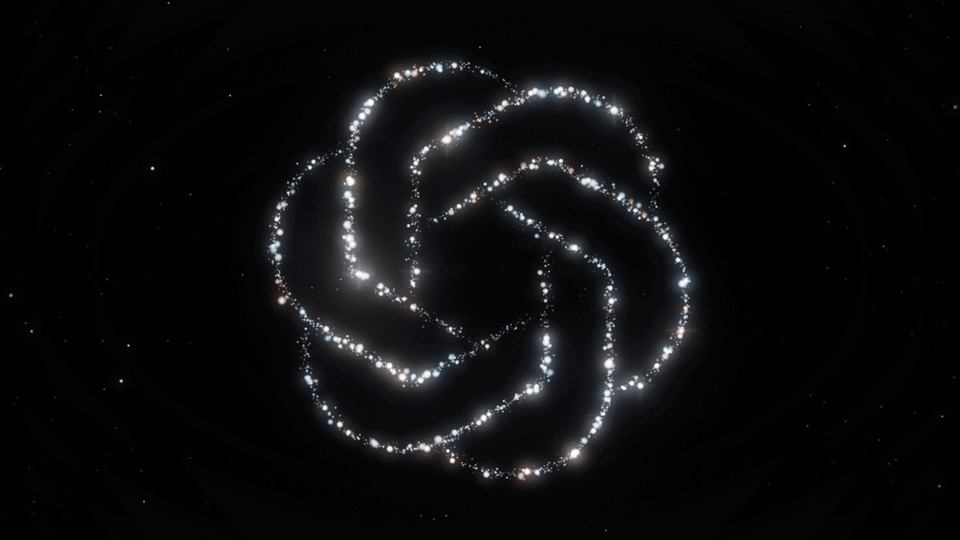
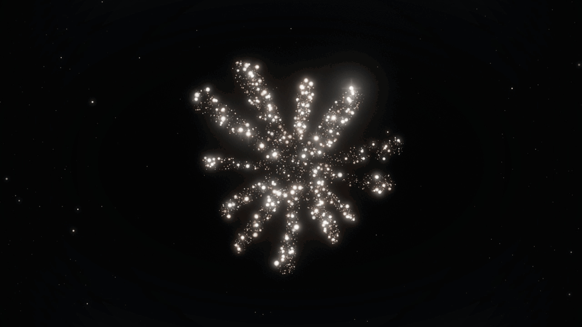
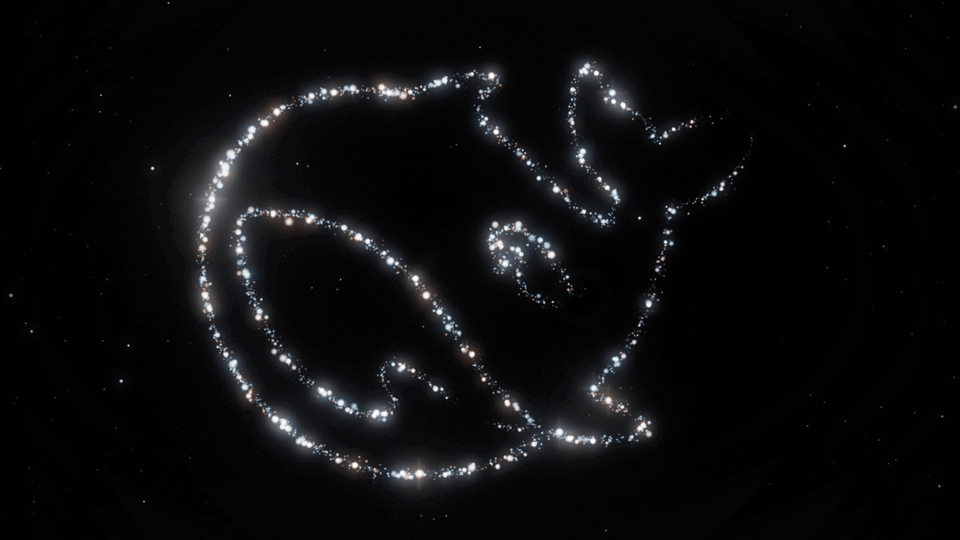

# Particle Showcase Public

[English](README.md) | **简体中文**

**把一张普通的 SVG、透明 PNG 或黑白轮廓，变成粒子视觉作品可以直接使用的形状数据。**



| Claude | DeepSeek |
| --- | --- |
|  |  |

*以上为单独制作的品牌粒子演示项目效果，使用外部引擎和品牌专属预设；这些引擎代码与预设不包含在公开版中。[演示素材说明](assets/README.md)。*

Particle Showcase Public 是一个面向 **AI Agent 和自动化工作流** 的图形处理工具。

它负责粒子视觉制作里最重复、也最容易出问题的一段工作：**准备图形、检查结构、转换形状数据，再交给粒子渲染引擎。**

输入一个简单 SVG、透明 PNG 或黑白轮廓，Particle Showcase 会生成标准化图形与形状数据，同时尽量保留原始结构中的：

* 外轮廓
* 内部孔洞
* 相互分离的独立部件
* 原始图形比例与结构关系

这些结果可以直接用于后续粒子系统、创意视觉实验，或者作为 AI Agent 自动生成视觉作品流程中的中间层。

如果再接入兼容的外部粒子渲染引擎，还可以进一步生成适合展示和录屏的交互页面，例如拖动旋转、动画重播，以及隐藏控制界面。

> **需要注意：Particle Showcase Public 不包含粒子渲染引擎。**
>
> 公开仓库提供的是图形转换工具、标准化形状数据和渲染接入适配。
> 图形转换可以独立使用；动态粒子展示需要另外准备兼容的渲染引擎。

---

## 它做什么

一个典型流程是：

```text
SVG / Transparent PNG / B&W Shape
                ↓
      Particle Showcase Public
                ↓
   Normalized Graphic / Shape Data
                ↓
        Your Particle Engine
                ↓
 Interactive Particle Showcase
```

Particle Showcase 处理的是中间这一层。

它不试图重新实现一套完整粒子引擎，而是把原本散落在不同脚本、格式转换和手工调整里的准备工作整理成一个稳定、可重复调用的流程。

---

## 功能亮点

### 适合 Agent 的工作流

Particle Showcase 从一开始就是按照 AI Agent 和自动化任务的使用方式设计的。

Agent 可以拿到一个图形后完成：

```text
读取输入
→ 判断图形类型
→ 标准化
→ 提取结构
→ 输出形状数据
→ 交给后续渲染流程
```

这样不需要每次碰到新图形，都重新写一套转换脚本。

### 保留孔洞与分离部件

很多图形并不是一个简单的实心轮廓。

例如：

* 字母 `O` 中间的孔洞
* 图标内部的镂空区域
* Logo 中彼此分开的几个元素
* 多个不相连的轮廓

Particle Showcase 会尽量保留这些结构，而不是粗暴地把整个图形压成一个实心形状。

### 支持常用的简单图形输入

目前主要面向这几类输入：

* SVG
* 带透明通道的 PNG
* 黑白轮廓图

这几种格式已经能够覆盖 Logo、图标、文字轮廓和大量简单视觉元素。

### 统一的输出结构

不同来源的图形经过处理后，可以转成统一的标准化图形和形状数据。

这意味着后面的粒子引擎不需要反复适配各种奇怪输入格式，只需要消费稳定的数据结构。

### 接入外部渲染引擎

公开版同时保留了面向外部渲染引擎的接入层。

接入兼容引擎后，可以进一步制作：

* 可拖动旋转的粒子展示
* 动画重播
* 隐藏控制界面
* 干净的录屏画面
* 图标 / Logo 粒子演示页面

**渲染能力来自外部引擎，Particle Showcase Public 负责准备数据与完成接入。**

---

## 使用场景

### Logo 与图标展示

把 Logo、产品图标或者品牌符号转换成粒子系统能够识别的形状，用于展示页、Demo 或视频素材。

### 创意视觉实验

快速测试一个符号、文字轮廓或者抽象图形放进粒子系统之后会产生什么效果。

重点可以放在视觉本身，而不是每次都先处理一遍 SVG 路径。

### 录屏素材制作

搭配兼容的粒子引擎，可以制作适合录屏的展示页面：

* 隐藏 UI
* 重播动画
* 调整观察角度
* 获取干净画面

适合短视频、产品演示或者视觉素材制作。

### AI Agent 工作流

Particle Showcase 也可以作为更大 Agent 工作流中的一个工具节点。

例如：

```text
用户提出视觉需求
        ↓
Agent 生成 SVG
        ↓
Particle Showcase 转换
        ↓
外部粒子引擎渲染
        ↓
生成展示页面 / 录屏素材
```

这样，“生成图形”和“粒子展示”之间就有了一层稳定接口。

---

## 快速开始

Particle Showcase Public 可以只做图形转换，也可以继续接入自己的粒子渲染环境。

### 1. 准备输入

准备一个简单图形：

```text
input/
├── logo.svg
├── icon.png
└── shape.png
```

推荐优先使用结构清晰的 SVG。

对于 PNG，请尽量使用：

* 透明背景
* 高对比度主体
* 清晰边缘
* 足够的输入分辨率

---

### 2. 转换图形

在仓库根目录使用 Python 3.12。SVG 转换只用标准库，可先运行仓库自带示例：

```sh
python scripts/shape.py --input examples/beacon.svg --out ../beacon-shape
```

PNG 另需 Pillow 和 NumPy。尚未准备依赖时，创建独立环境并安装锁定版本：

```sh
python -m venv .venv
# macOS / Linux
source .venv/bin/activate
# Windows PowerShell 使用：.venv\Scripts\Activate.ps1
python -m pip install -r requirements.txt
python scripts/shape.py --input examples/beacon.png --out ../beacon-png-shape
```

`python` 应指向 Python 3.12。输出目录须为新目录或空目录；产物结构是：

```text
beacon-shape/
├── original.svg       # PNG 输入时为 original.png
├── normalized.svg
├── shape.json
└── manifest.json
```

PNG 转换还会生成 `traced.svg`。`manifest.json` 记录原件摘要、转换设置和检查结果；生成文件本身不代表已通过浏览器视觉验收。

---

### 3. 使用生成的数据

到这一步，**Particle Showcase Public 本身的核心转换工作已经完成。**

生成的数据可以：

* 被自己的 WebGL / Three.js / Canvas 粒子程序读取
* 进入现有粒子系统
* 作为其他 Agent 工具的输入
* 继续进行视觉分析或图形处理

自定义渲染程序需要自行读取并适配 `shape.json`；仓库附带的导出适配器只支持 [运行说明](docs/RUNTIME.md) 中列出的固定引擎契约。

并不要求一定使用粒子展示页面。

---

### 4. 可选：接入粒子渲染引擎

如果已有符合固定契约、并有权使用的粒子渲染引擎，可按 [运行说明](docs/RUNTIME.md) 接入。导出目录必须放在本工具和引擎目录之外：

```sh
python scripts/export.py --runtime /path/to/compatible-runtime --shape ../beacon-shape/shape.json --dest ../beacon-particles
cd ../beacon-particles
npm ci
node build.mjs --check
node build.mjs
python serve.py --port 4195
```

打开 `http://127.0.0.1:4195/`。拖动或方向键旋转，R 重播，H 隐藏控制，Esc 或恢复按钮显示控制。需要 Node.js 22.13+ 和支持 WebGL 的浏览器；Ctrl+C 停止本地预览。

`npm ci` 会联网获取依赖，并按依赖配置执行安装脚本。只在新导出目录中安装，不需要全局安装，也不使用其他项目的 node_modules 链接。

完整链路变成：

```text
Graphic
  ↓
Particle Showcase Public
  ↓
Shape Data
  ↓
External Particle Renderer
  ↓
Interactive Showcase
```

最终展示层可以根据所接入引擎的能力提供：

* 粒子聚合 / 解散动画
* 拖动或方向键旋转
* 动画重播
* 控制界面隐藏
* 录屏模式

这些功能**不属于公开仓库内置的粒子引擎能力**。

---

## 输入要求

为了获得稳定结果，建议输入尽量保持简单、明确。

### SVG

当前接受：

* 显式且宽高为正的 `viewBox`
* 1–32 条单色闭合 `<path>`，每个轮廓以 `Z` 闭合
* `nonzero` / `evenodd` 孔洞，以及分离部件
* 不含 transform 的分组；单文件不超过 256 KB

基础形状、文字和描边需要先转换为闭合路径。**transform、`<text>`、mask、clipPath、filter、gradient、pattern、脚本与外部资源引用会被拒绝**，而不只是“复杂时可能需要处理”。请先在图形编辑器中整理，不跳过输入校验。

SVG 保留原坐标与 viewBox。白色覆盖块不等于孔洞，应使用复合轮廓定义镂空。微小细节即使保留在数据中，也可能在粒子采样和光晕下难以辨认。

---

### 透明 PNG

推荐：

* 背景透明
* 主体边缘清晰
* Alpha 通道明确
* 尽量减少半透明阴影
* 避免复杂纹理和照片内容

PNG 会经过轮廓 / 区域提取，因此输入质量会直接影响最终 Shape Data。

仅支持静态 PNG；最大 4,194,304 像素、单边不超过 4096 像素。自动识别透明度、深色或浅色前景；有歧义时可传入 `--foreground alpha|dark|light` 和 `--threshold`（默认 128）。透明输入使用 alpha，深浅色模式要求不透明灰度图。16 位输入仅支持灰度，其他 16 位彩色格式须先转换。

空白边缘会裁掉，轮廓内部的结构关系保留；超出轮廓复杂度限制的输入会报错，不会静默丢弃小部件。

照片、渐变背景和大量细碎纹理通常并不是理想输入。

---

### 黑白轮廓

黑白图形应保证前景和背景具有明显区分。

适合：

* 图标
* 字符轮廓
* Logo
* 剪影
* 简单几何形状

如果输入存在大量噪点、模糊边缘或压缩伪影，建议先进行清理。

---

## 能力边界

为了避免对项目能力产生错误预期：

**它不是：**

* 一个完整的粒子渲染引擎
* 一个上传图片就自动生成最终动画的视频工具
* 一个完整的 Three.js / WebGL 可视化框架
* 一个通用 SVG 渲染器
* 一个图片特效生成平台

**它更接近于：**

> 图形输入与粒子渲染之间的一层标准化工具和适配层。

如果已经有自己的粒子引擎，这一层可以省掉大量重复的图形处理工作。

如果没有粒子引擎，也仍然可以单独使用它完成图形标准化和 Shape Data 提取。

---

## 依赖

Particle Showcase Public 的依赖主要来自两部分：

### 图形转换依赖

用于：

* SVG 解析
* PNG / Alpha 数据处理
* 轮廓与区域提取
* 图形标准化
* Shape Data 生成

SVG 只需 Python 3.12 标准库；PNG 使用 [requirements.txt](requirements.txt) 中固定的 Pillow 和 NumPy。

### 渲染依赖

**不包含在 Particle Showcase Public 中。**

如果需要动态粒子展示，需要自行提供兼容的渲染环境或粒子引擎，例如基于：

* WebGL
* Three.js
* Canvas
* 自定义 GPU 粒子系统

这些是可编写自定义适配器的技术方向，不表示仓库自带通用适配。现成导出器只支持固定契约；[package-lock.json](package-lock.json) 固定构建依赖，[THIRD_PARTY.md](THIRD_PARTY.md) 说明引擎与资源的许可范围。

---

## 公开仓库范围

公开版本主要包含：

* 图形输入处理
* 图形标准化
* Shape Data 生成
* 孔洞与分离部件处理
* 面向 Agent 的可复用转换流程
* 外部粒子渲染引擎接入适配
* 示例与基础文档

公开版本**不会分发不属于本项目的第三方或私有粒子渲染引擎代码。**

如果某个示例需要额外渲染组件，请按照对应说明自行配置。

---

## 验证

```sh
python -m unittest discover -s tests -v
```

[验证记录](docs/VALIDATION.md) 区分单元测试、GitHub CI 和实际页面检查。自编模拟引擎只能验证适配与构建，不能证明粒子效果；安装后的新输入仍需要实际查看。

## 许可

Particle Showcase Public 的源码使用仓库中 `LICENSE` 文件声明的许可协议。

请注意：

MIT 许可覆盖本工具代码、文档和自编通用测试示例。**品牌 Logo 及其演示 GIF 不因存放在本仓库中而获得 MIT 授权**；它们仅用于效果说明，不表示与相关品牌存在合作或背书。详见 [第三方声明](THIRD_PARTY.md) 和 [演示素材说明](assets/README.md)。

通过适配层接入的外部粒子引擎、第三方库、字体、Logo、图形素材或其他资源，仍然分别受它们自己的许可证与使用条款约束。

在公开发布、商业项目或二次分发前，请确认相关资源拥有对应使用权限。

---

## 为什么做 Particle Showcase？

一个粒子效果真正开始渲染之前，经常还有一堆不起眼的工作：

```text
找图
→ 改 SVG
→ 清轮廓
→ 处理孔洞
→ 拆分部件
→ 调坐标
→ 转数据
→ 改接口
→ 最后才能开始看效果
```

单独看，每一步都不复杂。

烦人的地方是，每换一张图，又来一次。

**Particle Showcase Public 想解决的，就是这一段。**

把静态图形整理成稳定、可复用的粒子形状输入，让 Agent 和渲染引擎把时间花在真正有意思的部分。
